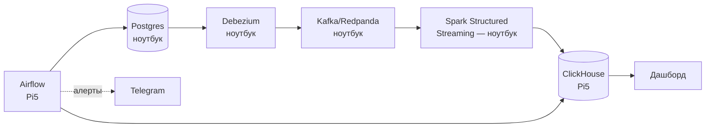

# PRD: Retail Analytics Platform (CDC)

Пет-проект для поиска позиции Data Engineer. Платформа операционной аналитики для условного онлайн-ритейлера: OLTP-источник → CDC → потоковая обработка → OLAP-хранилище, с бизнес-метриками поверх.

- **Статус:** готов к разработке
- **Кодовое имя компании:** ShopFlow (условный онлайн-ритейлер)

---

## 1. Цель и мотивация

- Построить платформу операционной аналитики: OLTP-источник → CDC → потоковая обработка → OLAP-хранилище, с бизнес-метриками поверх.
- Усилить портфолио для поиска позиции Data Engineer: закрыть пробел «работал только с батчем» реальным CDC/streaming-опытом и продолжить историю ритейл-стриминга, начатую в X5 Tech (Flink/Iceberg/S3), но на новом стеке (Kafka/Spark/ClickHouse).
- Иметь готовую техническую историю для интервью: почему CDC, а не батч-выгрузки; как спроектирована звёздная схема с SCD2; какие компромиссы возникли из-за ограничений Raspberry Pi 5.

## 2. Бизнес-сценарий

Условный онлайн-ритейлер («ShopFlow») ведёт операционную деятельность в Postgres:

- принимает заказы через сайт/приложение;
- ведёт каталог товаров с изменяющимися ценами;
- хранит профили клиентов с изменяющимся адресом/сегментом;
- управляет складскими остатками по нескольким точкам.

Бизнес-задача, которую решает платформа: дать аналитикам и менеджменту почти-реалтайм видимость по выручке, воронке и остаткам — без нагрузки на продовую OLTP-базу и без суточной задержки батч-ETL.

## 3. Функциональные требования

| ID | Требование |
| --- | --- |
| FR-1 | Захват изменений (insert/update/delete) из таблиц `orders`, `order_items`, `products`, `customers`, `inventory` в Postgres через CDC, без изменения кода приложения |
| FR-2 | Потоковая доставка изменений в ClickHouse с задержкой не более нескольких минут |
| FR-3 | SCD Type 2 для `customers` (история смены адреса/сегмента) и `products` (история изменения цены) |
| FR-4 | Витрина выручки по дням/категориям |
| FR-5 | Витрина воронки: заказ создан → оплачен → доставлен |
| FR-6 | Когортный анализ удержания клиентов |
| FR-7 | Витрина топ товаров и остатков на складе |
| FR-8 | Ежедневная сверка (reconciliation) между Postgres и ClickHouse с детектом расхождений |
| FR-9 | Data quality проверки: отсутствие дублей по ключу заказа, отсутствие отрицательных сумм, отсутствие «осиротевших» `order_items` без `orders` |
| FR-10 | Дашборд со всеми витринами, обновляется почти в реальном времени |
| FR-11 | Алерты в Telegram при провале DAG'а или расхождении при сверке |

## 4. Нефункциональные требования

| ID | Требование |
| --- | --- |
| NFR-1 | Postgres, CDC-коннектор, брокер сообщений и Spark работают на ноутбуке (Docker Compose) |
| NFR-2 | ClickHouse и Airflow работают на Raspberry Pi 5 (8 ГБ), доступны по сети с ноутбука |
| NFR-3 | Задержка от изменения в Postgres до появления в ClickHouse: до 5 минут приемлемо |
| NFR-4 | Идемпотентность записи в ClickHouse — повторная доставка события не должна дублировать строку |
| NFR-5 | Хранение сырых CDC-событий: 30 дней; агрегатов — без ограничения (TTL в ClickHouse) |
| NFR-6 | Устойчивость к раздельному перезапуску Pi5 и ноутбука — брокер сообщений выступает буфером на время недоступности любой из сторон |
| NFR-7 | ClickHouse и Airflow на Pi5 должны укладываться в ~6 ГБ RAM с запасом под ОС |

## 5. Доменная модель и схема данных

### 5.1 OLTP-схема (Postgres)

```sql
CREATE TABLE customers (
    customer_id   BIGSERIAL PRIMARY KEY,
    name          TEXT NOT NULL,
    email         TEXT NOT NULL,
    address       TEXT,
    segment       TEXT,
    updated_at    TIMESTAMPTZ NOT NULL DEFAULT now()
);

CREATE TABLE products (
    product_id    BIGSERIAL PRIMARY KEY,
    name          TEXT NOT NULL,
    category      TEXT NOT NULL,
    price         NUMERIC(10,2) NOT NULL,
    updated_at    TIMESTAMPTZ NOT NULL DEFAULT now()
);

CREATE TABLE orders (
    order_id      BIGSERIAL PRIMARY KEY,
    customer_id   BIGINT NOT NULL REFERENCES customers(customer_id),
    status        TEXT NOT NULL, -- created | paid | shipped | delivered | cancelled
    created_at    TIMESTAMPTZ NOT NULL DEFAULT now(),
    updated_at    TIMESTAMPTZ NOT NULL DEFAULT now()
);

CREATE TABLE order_items (
    order_item_id   BIGSERIAL PRIMARY KEY,
    order_id        BIGINT NOT NULL REFERENCES orders(order_id),
    product_id      BIGINT NOT NULL REFERENCES products(product_id),
    quantity        INT NOT NULL,
    price_at_order  NUMERIC(10,2) NOT NULL
);

CREATE TABLE inventory (
    product_id    BIGINT NOT NULL REFERENCES products(product_id),
    warehouse_id  INT NOT NULL,
    quantity      INT NOT NULL,
    updated_at    TIMESTAMPTZ NOT NULL DEFAULT now(),
    PRIMARY KEY (product_id, warehouse_id)
);

-- Важно для CDC: без REPLICA IDENTITY FULL Debezium не увидит старые значения
-- при UPDATE/DELETE (нужны для SCD2 и для дедупликации).
ALTER TABLE customers REPLICA IDENTITY FULL;
ALTER TABLE products  REPLICA IDENTITY FULL;
ALTER TABLE orders    REPLICA IDENTITY FULL;
```

Postgres должен быть запущен с `wal_level = logical` (для Debezium/логической репликации).

Данные генерируются синтетическим генератором нагрузки (Python-скрипт), имитирующим создание заказов, смену статусов, изменение цен и остатков с реалистичной частотой и сезонностью (пиковые часы, распродажи).

### 5.2 OLAP-схема (ClickHouse)

```sql
-- Сырой слой: события CDC как есть, для отладки и повторной обработки
CREATE TABLE raw_events (
    topic         String,
    event_time    DateTime64(3),
    op            LowCardinality(String), -- c | u | d | r
    payload       String -- сырой JSON
) ENGINE = MergeTree
ORDER BY (topic, event_time)
TTL event_time + INTERVAL 30 DAY;

-- SCD2-измерение клиентов
CREATE TABLE dim_customers (
    customer_id   UInt64,
    name          String,
    address       String,
    segment       String,
    valid_from    DateTime,
    valid_to      Nullable(DateTime),
    is_current    UInt8
) ENGINE = ReplacingMergeTree(valid_from)
ORDER BY (customer_id, valid_from);

-- SCD2-измерение товаров
CREATE TABLE dim_products (
    product_id    UInt64,
    name          String,
    category      String,
    price         Decimal(10,2),
    valid_from    DateTime,
    valid_to      Nullable(DateTime),
    is_current    UInt8
) ENGINE = ReplacingMergeTree(valid_from)
ORDER BY (product_id, valid_from);

-- Факт заказов (идемпотентная запись через ReplacingMergeTree по версии)
CREATE TABLE fact_orders (
    order_item_id   UInt64,
    order_id        UInt64,
    customer_id     UInt64,
    product_id      UInt64,
    quantity         UInt32,
    price_at_order   Decimal(10,2),
    status           LowCardinality(String),
    order_created_at DateTime,
    version          UInt64 -- используется ReplacingMergeTree для дедупликации
) ENGINE = ReplacingMergeTree(version)
ORDER BY (order_item_id);
```

## 6. Архитектура



Тяжёлые по памяти компоненты (брокер сообщений, Spark) — на ноутбуке; лёгкие по CPU, но требующие постоянной доступности (ClickHouse как хранилище, Airflow как планировщик) — на Pi5, который работает как always-on сервер с низким энергопотреблением.

### 6.1 Сеть ноутбук ↔ Pi5

- Pi5 получает статический IP (или DHCP-резервацию) в домашней сети.
- Открытые порты на Pi5: ClickHouse HTTP (8123), ClickHouse native (9000), Airflow webserver (8080).
- Аутентификация — базовая (домашняя сеть, наружу не пробрасывается); порты наружу не открывать.

### 6.2 Топики брокера сообщений

Соглашение об именовании (формат Debezium по умолчанию): `cdc.public.<table>` — например `cdc.public.orders`, `cdc.public.order_items`, `cdc.public.customers`, `cdc.public.products`, `cdc.public.inventory`.

## 7. Технологический стек

| Компонент | Технология | Почему |
| --- | --- | --- |
| OLTP-источник | Postgres | Стандарт для симуляции продовой системы, поддерживает логическую репликацию для CDC |
| CDC | Debezium | Индустриальный стандарт CDC из Postgres, частая тема на собеседованиях |
| Брокер сообщений | Kafka **или** Redpanda | Буфер между CDC и обработкой. Redpanda — Kafka-совместимый однобинарник, заметно легче для ноутбука (без ZooKeeper); Kafka — более узнаваемое имя на собеседовании. Решить перед стартом Milestone 1 |
| Потоковая обработка | Spark Structured Streaming | Продолжение опыта на Flink в X5 — второй streaming-движок в портфолио |
| OLAP-хранилище | ClickHouse | Продолжает историю про интервью в SberData |
| Оркестрация | Airflow | Знаком по прошлому опыту, стандарт индустрии для DAG-оркестрации |
| Дашборд | Grafana или Superset | Открытый вопрос — см. раздел 13 |

## 8. Структура репозитория

```
retail-cdc-platform/
├── docker-compose.laptop.yml   # Postgres, Debezium (Kafka Connect), Kafka/Redpanda
├── docker-compose.pi5.yml      # ClickHouse, Airflow
├── generator/
│   └── generate_orders.py      # синтетический генератор нагрузки
├── spark-jobs/
│   └── streaming_to_clickhouse.py
├── clickhouse/
│   └── ddl/                    # SQL из раздела 5.2
├── airflow/
│   └── dags/
│       ├── reconciliation_dag.py
│       ├── data_quality_dag.py
│       └── retention_dag.py
├── dashboards/
├── infra/
│   └── pi5/                    # конфиги хоста Pi5 (fstab, daemon.json, ufw) и runbook
├── docs/
│   └── architecture.md
└── README.md
```

## 9. Конфигурация и окружение

`.env` (пример):

```
POSTGRES_HOST=localhost
POSTGRES_DB=shopflow
POSTGRES_USER=shopflow
POSTGRES_PASSWORD=changeme

KAFKA_BOOTSTRAP=localhost:9092

PI5_HOST=192.168.1.50
CLICKHOUSE_HTTP_PORT=8123
CLICKHOUSE_NATIVE_PORT=9000
CLICKHOUSE_USER=shopflow
CLICKHOUSE_PASSWORD=changeme

AIRFLOW_WEBSERVER_PORT=8080
AIRFLOW_ADMIN_USER=admin
AIRFLOW_ADMIN_PASSWORD=changeme
TELEGRAM_BOT_TOKEN=
TELEGRAM_CHAT_ID=
```

## 10. План реализации

**Milestone 0 — подготовка окружения**
- [ ] Развернуть Pi5: ОС, Docker, статический IP в локальной сети
- [ ] Проверить доступность Pi5 с ноутбука (ping, нужные порты)

**Milestone 1 — MVP: связность**
- [ ] `docker-compose.laptop.yml`: Postgres + Debezium (Kafka Connect) + Kafka/Redpanda
- [ ] Включить логическую репликацию в Postgres (`wal_level=logical`, `REPLICA IDENTITY FULL`)
- [ ] Синтетический генератор — базовые insert/update в `orders`, `customers`
- [ ] Проверить, что CDC-события доходят до топиков брокера
- [ ] ClickHouse на Pi5 — поднять, создать таблицы из раздела 5.2, вручную залить тестовые события

**Milestone 2 — потоковая обработка**
- [ ] Spark Structured Streaming job: чтение из брокера, запись в `raw_events`
- [ ] Идемпотентность (дедупликация по ключу + версии перед записью в fact/dim)

**Milestone 3 — моделирование данных**
- [ ] SCD2-логика для `dim_customers`, `dim_products`
- [ ] Заполнение `fact_orders`
- [ ] Материализованные представления для дневных агрегатов (выручка, воронка)

**Milestone 4 — оркестрация и качество**
- [ ] Airflow на Pi5
- [ ] DAG сверки Postgres ↔ ClickHouse
- [ ] DAG data quality (FR-9)
- [ ] DAG ретеншна/TTL

**Milestone 5 — наблюдаемость и презентация**
- [ ] Дашборд (Grafana/Superset) — витрины из FR-4–FR-7
- [ ] Алерты в Telegram (FR-11)
- [ ] README с диаграммой архитектуры и инструкцией по запуску

## 11. Вне скоупа v1

- ML-модели (прогноз спроса, рекомендации)
- Мультитенантность / несколько магазинов
- Реальные интеграции с внешними платёжными/логистическими системами
- Мобильное приложение или UI для генератора нагрузки
- Exactly-once гарантии end-to-end (ограничиваемся идемпотентностью на стороне ClickHouse)

## 12. Критерии успеха

- Пайплайн работает автономно ≥2 недели, переживает раздельный перезапуск Pi5 и ноутбука
- Сверка Postgres ↔ ClickHouse не показывает расхождений (или они детектируются и алертятся)
- Готова связная история для интервью: почему CDC вместо батча, как спроектирована SCD2, какие компромиссы возникли из-за ограничений Pi5, как обеспечена идемпотентность
- Репозиторий на GitHub с README, диаграммой архитектуры и инструкцией по запуску — ссылку можно приложить в резюме/сопроводительном письме

## 13. Открытые вопросы

- **Дашборд:** Grafana или Superset — не зафиксировано.
- **Брокер сообщений:** Kafka или Redpanda — решить перед Milestone 1 (см. раздел 7).
