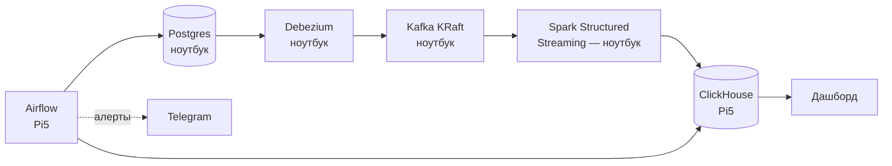

# PRD: Retail Analytics Platform (CDC)

Пет-проект для поиска позиции Data Engineer. Платформа операционной аналитики для условного онлайн-ритейлера: OLTP-источник → CDC → потоковая обработка → OLAP-хранилище, с бизнес-метриками поверх.

- **Статус:** готов к разработке
- **Кодовое имя компании:** ShopFlow (условный онлайн-ритейлер)

---

## 1. Цель и мотивация

- Построить платформу операционной аналитики: OLTP-источник → CDC → потоковая обработка → OLAP-хранилище, с бизнес-метриками поверх.
- Усилить портфолио для поиска позиции Data Engineer: закрыть пробел «работал только с батчем» реальным CDC/streaming-опытом и продолжить историю ритейл-стриминга, начатую в X5 Tech (Flink/Iceberg/S3), но на новом стеке (Kafka/Spark/ClickHouse).
- Иметь готовую техническую историю для интервью: почему CDC, а не батч-выгрузки; как спроектирована звёздная схема с SCD2; какие компромиссы возникли из-за ограничений Raspberry Pi 5.

## 2. Бизнес-сценарий

Условный онлайн-ритейлер («ShopFlow») ведёт операционную деятельность в Postgres:

- принимает заказы через сайт/приложение;
- ведёт каталог товаров с изменяющимися ценами;
- хранит профили клиентов с изменяющимся адресом/сегментом;
- управляет складскими остатками по нескольким точкам.

Бизнес-задача, которую решает платформа: дать аналитикам и менеджменту почти-реалтайм видимость по выручке, воронке и остаткам — без нагрузки на продовую OLTP-базу и без суточной задержки батч-ETL.

## 3. Функциональные требования

| ID | Требование |
| --- | --- |
| FR-1 | Захват изменений (insert/update/delete) из таблиц `orders`, `order_items`, `products`, `customers`, `inventory` в Postgres через CDC, без изменения кода приложения |
| FR-2 | Потоковая доставка изменений в ClickHouse с задержкой не более нескольких минут |
| FR-3 | SCD Type 2 для `customers` (история смены адреса/сегмента) и `products` (история изменения цены) |
| FR-4 | Витрина выручки по дням/категориям |
| FR-5 | Витрина воронки: заказ создан → оплачен → доставлен |
| FR-6 | Когортный анализ удержания клиентов |
| FR-7 | Витрина топ товаров и остатков на складе |
| FR-8 | Ежедневная сверка (reconciliation) между Postgres и ClickHouse с детектом расхождений |
| FR-9 | Data quality проверки: отсутствие дублей по ключу заказа, отсутствие отрицательных сумм, отсутствие «осиротевших» `order_items` без `orders` |
| FR-10 | Дашборд со всеми витринами, обновляется почти в реальном времени |
| FR-11 | Алерты в Telegram при провале DAG'а или расхождении при сверке |

## 4. Нефункциональные требования

| ID | Требование |
| --- | --- |
| NFR-1 | Postgres, CDC-коннектор, брокер сообщений и Spark работают на ноутбуке (Docker Compose) |
| NFR-2 | ClickHouse и Airflow работают на Raspberry Pi 5 (8 ГБ), доступны по сети с ноутбука |
| NFR-3 | Задержка от изменения в Postgres до появления в ClickHouse: до 5 минут приемлемо |
| NFR-4 | Идемпотентность записи в ClickHouse — повторная доставка события не должна дублировать строку |
| NFR-5 | Хранение сырых CDC-событий: 30 дней; агрегатов — без ограничения (TTL в ClickHouse) |
| NFR-6 | Устойчивость к раздельному перезапуску Pi5 и ноутбука — брокер сообщений выступает буфером на время недоступности любой из сторон |
| NFR-7 | ClickHouse и Airflow на Pi5 должны укладываться в ~6 ГБ RAM с запасом под ОС |

## 5. Доменная модель и схема данных

### 5.1 OLTP-схема (Postgres)

```sql
CREATE TABLE customers (
    customer_id   BIGSERIAL PRIMARY KEY,
    name          TEXT NOT NULL,
    email         TEXT NOT NULL,
    address       TEXT,
    segment       TEXT,
    updated_at    TIMESTAMPTZ NOT NULL DEFAULT now()
);

CREATE TABLE products (
    product_id    BIGSERIAL PRIMARY KEY,
    name          TEXT NOT NULL,
    category      TEXT NOT NULL,
    price         NUMERIC(10,2) NOT NULL,
    updated_at    TIMESTAMPTZ NOT NULL DEFAULT now()
);

CREATE TABLE orders (
    order_id      BIGSERIAL PRIMARY KEY,
    customer_id   BIGINT NOT NULL REFERENCES customers(customer_id),
    status        TEXT NOT NULL, -- created | paid | shipped | delivered | cancelled
    created_at    TIMESTAMPTZ NOT NULL DEFAULT now(),
    updated_at    TIMESTAMPTZ NOT NULL DEFAULT now()
);

CREATE TABLE order_items (
    order_item_id   BIGSERIAL PRIMARY KEY,
    order_id        BIGINT NOT NULL REFERENCES orders(order_id),
    product_id      BIGINT NOT NULL REFERENCES products(product_id),
    quantity        INT NOT NULL,
    price_at_order  NUMERIC(10,2) NOT NULL
);

CREATE TABLE inventory (
    product_id    BIGINT NOT NULL REFERENCES products(product_id),
    warehouse_id  INT NOT NULL,
    quantity      INT NOT NULL,
    updated_at    TIMESTAMPTZ NOT NULL DEFAULT now(),
    PRIMARY KEY (product_id, warehouse_id)
);

-- Важно для CDC: без REPLICA IDENTITY FULL Debezium не увидит старые значения
-- при UPDATE/DELETE (нужны для SCD2, DQ и отладки). См. docs/adr/0005-cdc-contract.md.
ALTER TABLE customers   REPLICA IDENTITY FULL;
ALTER TABLE products    REPLICA IDENTITY FULL;
ALTER TABLE orders      REPLICA IDENTITY FULL;
ALTER TABLE order_items REPLICA IDENTITY FULL;
ALTER TABLE inventory   REPLICA IDENTITY FULL;
```

Postgres должен быть запущен с `wal_level = logical` (для Debezium/логической репликации).

Данные генерируются синтетическим генератором нагрузки (Python-скрипт), имитирующим создание заказов, смену статусов, изменение цен и остатков с реалистичной частотой и сезонностью (пиковые часы, распродажи).

### 5.2 OLAP-схема (ClickHouse)

Ключи и версии обоснованы в `docs/adr/0006-clickhouse-schema-idempotency.md`. Версия (`version`) = `source.lsn` Debezium: LSN изменения монотонен для одной строки Postgres, но не сравним между таблицами. Поэтому каждая таблица ниже соответствует одной таблице Postgres, а `fact_orders` собирается из staging. Все таблицы в базе `shopflow`, время в UTC. Точный DDL в `clickhouse/ddl/`.

```sql
-- Сырой слой: события CDC как есть, для отладки и повторной обработки.
-- Ключ = позиция в Kafka (+ LSN на случай пересоздания топика): повтор от Spark схлопывается.
CREATE TABLE raw_events (
    topic           LowCardinality(String),
    kafka_partition UInt32,
    kafka_offset    UInt64,
    source_lsn      UInt64,
    event_key       String,                  -- ключ сообщения Kafka (PK строки, JSON)
    event_time      DateTime64(3, 'UTC'),    -- source.ts_ms, время коммита в Postgres
    op              LowCardinality(String),  -- c | u | d | r
    payload         String,                  -- сырой JSON (полный конверт Debezium)
    ingested_at     DateTime64(3, 'UTC') DEFAULT now64(3)
) ENGINE = ReplacingMergeTree
PARTITION BY toYYYYMMDD(event_time)
ORDER BY (topic, kafka_partition, kafka_offset, source_lsn)
TTL toDateTime(event_time) + INTERVAL 30 DAY
SETTINGS ttl_only_drop_parts = 1;

-- Staging: последнее состояние строки Postgres, одна таблица на таблицу источника.
CREATE TABLE stg_orders (
    order_id    UInt64,
    customer_id UInt64,
    status      LowCardinality(String),
    created_at  DateTime64(6, 'UTC'),  -- микросекунды для ASOF JOIN к dim_products (ADR-0009)
    updated_at  DateTime64(3, 'UTC'),
    event_time  DateTime64(3, 'UTC'),  -- source.ts_ms, окно лага FR-8/FR-9 (ADR-0009)
    version     UInt64,  -- source.lsn
    is_deleted  UInt8
) ENGINE = ReplacingMergeTree(version, is_deleted)
ORDER BY order_id;

CREATE TABLE stg_order_items (
    order_item_id  UInt64,
    order_id       UInt64,
    product_id     UInt64,
    quantity       Int32,   -- как INT в Postgres: отрицательное видно DQ (ADR-0008)
    price_at_order Decimal(10, 2),
    event_time     DateTime64(3, 'UTC'),
    version        UInt64,  -- source.lsn
    is_deleted     UInt8
) ENGINE = ReplacingMergeTree(version, is_deleted)
ORDER BY order_item_id;

-- SCD2-измерения: цели refreshable MV, полный пересчёт из журналов stg_*_versions
-- в порядке LSN (ADR-0009). Прямые записи стираются следующим refresh.
CREATE TABLE dim_customers (
    customer_id UInt64,
    name        String,
    address     String,
    segment     LowCardinality(String),
    valid_from  DateTime64(6, 'UTC'),            -- source.ts_us
    valid_to    Nullable(DateTime64(6, 'UTC')),
    is_current  UInt8,
    version     UInt64                           -- source.lsn строки версии
) ENGINE = ReplacingMergeTree(version)
ORDER BY (customer_id, valid_from);

CREATE TABLE dim_products (
    product_id UInt64,
    name       String,
    category   LowCardinality(String),
    price      Decimal(10, 2),
    valid_from DateTime64(6, 'UTC'),
    valid_to   Nullable(DateTime64(6, 'UTC')),
    is_current UInt8,
    version    UInt64
) ENGINE = ReplacingMergeTree(version)
ORDER BY (product_id, valid_from);

-- M3 (ADR-0009, точный DDL в clickhouse/ddl/):
-- stg_customer_versions, stg_product_versions: журнал версий из Spark,
--   RMT(version) ORDER BY (id, valid_from = source.ts_us), is_snapshot, is_deleted, event_time.
-- stg_order_status_history: (order_id, status, changed_at, is_snapshot, version),
--   RMT(version) ORDER BY (order_id, status, version); витрина берёт min(changed_at).
-- stg_inventory: RMT(version, is_deleted) ORDER BY (product_id, warehouse_id), event_time.
-- fact_orders: VIEW, зерно — позиция заказа: stg_order_items FINAL JOIN stg_orders FINAL,
--   ASOF LEFT JOIN dim_products по created_at >= valid_from (категория и цена на момент заказа).
--   Денормализация в стриме отклонена: версия из двух топиков теряет обновления.
-- mart_revenue_daily, mart_funnel_daily: refreshable MV, полный пересчёт каждые 2 мин,
--   цепочка DEPENDS ON dim_products_mv; refreshed_at и source_watermark для замера NFR-3.
```

Служебная таблица `dq_check_results` (M4, ADR-0010): результаты сверки FR-8, проверок FR-9 и ретеншна NFR-5, одна строка на (запуск DAG, проверка, таблица), `ReplacingMergeTree(checked_at)` — повтор задачи перезаписывает свою строку. Пишет только `airflow_reader`, читает дашборд M5.

## 6. Архитектура



Тяжёлые по памяти компоненты (брокер сообщений, Spark) — на ноутбуке; лёгкие по CPU, но требующие постоянной доступности (ClickHouse как хранилище, Airflow как планировщик) — на Pi5, который работает как always-on сервер с низким энергопотреблением.

### 6.1 Сеть ноутбук ↔ Pi5

- Pi5 получает статический IP (или DHCP-резервацию) в домашней сети.
- Открытые порты на Pi5: ClickHouse HTTP (8123), ClickHouse native (9000), Airflow webserver (8080), Grafana (3000, M5).
- Аутентификация — базовая (домашняя сеть, наружу не пробрасывается); порты наружу не открывать.
- Ноутбук (с Milestone 4, FR-8): Postgres (5432) на LAN-адресе ноутбука, `pg_hba` пускает из LAN только роль `recon_reader` (только SELECT) с IP Pi5. См. `docs/adr/0010-airflow-pi5-postgres-access.md`.

### 6.2 Топики брокера сообщений

Соглашение об именовании (формат Debezium по умолчанию): `cdc.public.<table>` — например `cdc.public.orders`, `cdc.public.order_items`, `cdc.public.customers`, `cdc.public.products`, `cdc.public.inventory`.

## 7. Технологический стек

| Компонент | Технология | Почему |
| --- | --- | --- |
| OLTP-источник | Postgres | Стандарт для симуляции продовой системы, поддерживает логическую репликацию для CDC |
| CDC | Debezium | Индустриальный стандарт CDC из Postgres, частая тема на собеседованиях |
| Брокер сообщений | Kafka (KRaft) | Буфер между CDC и обработкой. Выбран вместо Redpanda: узнаваемее на собеседовании, нативная экосистема Kafka Connect/Debezium; KRaft убирает ZooKeeper. См. `docs/adr/0001-message-broker-kafka.md` |
| Потоковая обработка | Spark Structured Streaming | Продолжение опыта на Flink в X5 — второй streaming-движок в портфолио |
| OLAP-хранилище | ClickHouse | Продолжает историю про интервью в SberData |
| Оркестрация | Airflow | Знаком по прошлому опыту, стандарт индустрии для DAG-оркестрации |
| Дашборд | Grafana | Выбрана 2026-10-03: на Pi5 работает при выключенном ноутбуке (NFR-6), ~0,4 ГБ в резерве ADR-0004. Superset отклонён: ≥ 1 ГБ и только на ноутбуке. См. `docs/adr/0011-grafana-pi5-telegram-alerts.md` |

## 8. Структура репозитория

```
retail-cdc-platform/
├── docker-compose.laptop.yml   # Postgres, Debezium (Kafka Connect), Kafka
├── docker-compose.pi5.yml      # ClickHouse, Airflow
├── generator/
│   └── generate_orders.py      # синтетический генератор нагрузки
├── spark-jobs/                 # образ Spark и streaming job (ADR-0008)
│   ├── Dockerfile
│   ├── shopflow_stream/        # разбор конверта, дедупликация
│   └── streaming_to_clickhouse.py
├── clickhouse/
│   └── ddl/                    # SQL из раздела 5.2
├── airflow/                    # образ Airflow и DAG (ADR-0010)
│   ├── Dockerfile
│   └── dags/
│       ├── shopflow_common/        # подключения, «источник недоступен», запись dq_check_results
│       ├── shopflow_checks/        # сверка (FR-8), DQ (FR-9), ретеншн (NFR-5)
│       ├── sql/dq/                 # проверки FR-9
│       ├── reconciliation_dag.py
│       ├── data_quality_dag.py
│       └── retention_dag.py
├── grafana/                    # образ Grafana с закреплённым плагином ClickHouse и provisioning (ADR-0011)
├── dashboards/                 # JSON дашбордов (provisioning из git)
├── infra/
│   ├── pi5/                    # конфиги хоста Pi5 (fstab, daemon.json, ufw, systemd) и runbook
│   └── laptop/                 # sysctl ноутбука для доступа Pi5 к Postgres (ADR-0010)
├── postgres/                   # init-скрипты и шаблон pg_hba
├── scripts/                    # DDL, пользователи ClickHouse, проверки; pi5/ — скрипты для Pi5
├── tests/                      # pytest; sql/ — на временных ClickHouse и Postgres
├── docs/
│   └── architecture.md
└── README.md
```

## 9. Конфигурация и окружение

`.env` (пример):

```
POSTGRES_HOST=localhost
POSTGRES_DB=shopflow
POSTGRES_USER=shopflow
POSTGRES_PASSWORD=changeme

KAFKA_BOOTSTRAP=localhost:9092

PI5_HOST=192.168.0.151
CLICKHOUSE_HTTP_PORT=8123
CLICKHOUSE_NATIVE_PORT=9000
CLICKHOUSE_USER=shopflow
CLICKHOUSE_PASSWORD=changeme

AIRFLOW_WEBSERVER_PORT=8080
AIRFLOW_ADMIN_USER=admin
AIRFLOW_ADMIN_PASSWORD=changeme
TELEGRAM_BOT_TOKEN=
TELEGRAM_CHAT_ID=

# Milestone 4 (ADR-0010): сверка Pi5 → Postgres ноутбука
LAPTOP_HOST=192.168.0.105
RECON_READER_PASSWORD=changeme
CLICKHOUSE_AIRFLOW_PASSWORD=changeme
```

Полный список переменных — `.env.example` (ноутбук) и `infra/pi5/pi5.env.example` (Pi5).

## 10. План реализации

**Milestone 0 — подготовка окружения**
- [ ] Развернуть Pi5: ОС, Docker, статический IP в локальной сети
- [ ] Проверить доступность Pi5 с ноутбука (ping, нужные порты)

**Milestone 1 — MVP: связность**
- [ ] `docker-compose.laptop.yml`: Postgres + Debezium (Kafka Connect) + Kafka
- [ ] Включить логическую репликацию в Postgres (`wal_level=logical`, `REPLICA IDENTITY FULL`)
- [ ] Синтетический генератор — базовые insert/update в `orders`, `customers`
- [ ] Проверить, что CDC-события доходят до топиков брокера
- [ ] ClickHouse на Pi5 — поднять, создать таблицы из раздела 5.2 (кроме `fact_orders`, он в M3), вручную залить тестовые события

**Milestone 2 — потоковая обработка**
- [ ] Spark Structured Streaming job: чтение из брокера, запись в `raw_events`
- [ ] Заполнение `stg_orders`, `stg_order_items` с дедупликацией по ключу + версии (LSN), см. `docs/adr/0008-spark-streaming-job.md`
- [ ] Устойчивость: повтор батча, недоступность ClickHouse, «ядовитые» события

**Milestone 3 — моделирование данных**
- [ ] SCD2-логика для `dim_customers`, `dim_products`
- [ ] `fact_orders` поверх `stg_orders`, `stg_order_items`; генерация `products`, `order_items`, `inventory`
- [ ] Материализованные представления для дневных агрегатов (выручка, воронка)

**Milestone 4 — оркестрация и качество**
- [ ] Airflow на Pi5
- [ ] DAG сверки Postgres ↔ ClickHouse
- [ ] DAG data quality (FR-9)
- [ ] DAG ретеншна/TTL

**Milestone 5 — наблюдаемость и презентация**
- [ ] Витрины (refreshable MV) для когорт (FR-6), топа товаров и остатков (FR-7) поверх `stg_orders`, `fact_orders` и `stg_inventory` из M3
- [ ] Дашборд Grafana на Pi5 (ADR-0011) — витрины из FR-4–FR-7 и здоровье пайплайна
- [ ] Алерты в Telegram (FR-11)
- [ ] README с диаграммой архитектуры и инструкцией по запуску

## 11. Вне скоупа v1

- ML-модели (прогноз спроса, рекомендации)
- Мультитенантность / несколько магазинов
- Реальные интеграции с внешними платёжными/логистическими системами
- Мобильное приложение или UI для генератора нагрузки
- Exactly-once гарантии end-to-end (ограничиваемся идемпотентностью на стороне ClickHouse)

## 12. Критерии успеха

- Пайплайн работает автономно ≥2 недели, переживает раздельный перезапуск Pi5 и ноутбука
- Сверка Postgres ↔ ClickHouse не показывает расхождений (или они детектируются и алертятся)
- Готова связная история для интервью: почему CDC вместо батча, как спроектирована SCD2, какие компромиссы возникли из-за ограничений Pi5, как обеспечена идемпотентность
- Репозиторий на GitHub с README, диаграммой архитектуры и инструкцией по запуску — ссылку можно приложить в резюме/сопроводительном письме

## 13. Открытые вопросы

Открытых вопросов нет. Дашборд: Grafana на Pi5 (решение 2026-10-03, ADR-0011).
