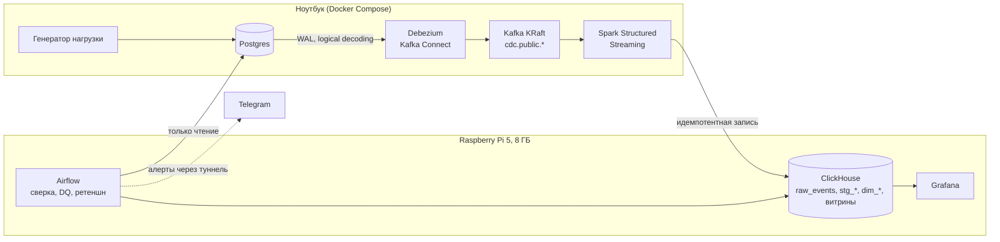

# ShopFlow: CDC-платформа операционной аналитики для ритейла

Пет-проект Data Engineer. Условный онлайн-ритейлер ведёт заказы, каталог, клиентов и склад в Postgres. Платформа забирает изменения из базы через CDC (без правок кода приложения), считает по ним SCD2, факт заказов и витрины, сверяет ClickHouse с Postgres и показывает всё на дашборде. Тяжёлая часть (Postgres, Kafka, Spark) живёт на ноутбуке, хранилище и оркестрация — на Raspberry Pi 5 с 8 ГБ памяти, и это определяет большинство решений ниже.

Спецификация — [`PRD-retail-cdc-platform.md`](PRD-retail-cdc-platform.md), решения — [`docs/adr/`](docs/adr), статус по задачам — [`docs/STATUS.md`](docs/STATUS.md).

## Архитектура



| Компонент | Где | Роль |
| --- | --- | --- |
| Postgres | ноутбук | OLTP-источник, `wal_level=logical`, `REPLICA IDENTITY FULL` на 5 таблицах CDC |
| Debezium (Kafka Connect) | ноутбук | снимает WAL в топики `cdc.public.<table>` |
| Kafka (KRaft) | ноутбук | буфер: Pi5 или ноутбук могут быть недоступны, события не теряются |
| Spark Structured Streaming | ноутбук | один запрос `foreachBatch`: `raw_events`, `stg_*`, журналы версий |
| ClickHouse | Pi5 | сырые события, стейджинг, SCD2, факт, витрины |
| Airflow 3.1 | Pi5 | сверка с Postgres, проверки качества, ретеншн, проба канала алертов |
| Grafana | Pi5 | дашборд из 27 панелей, читает только витрины |

## Что считается

| Требование | Реализация |
| --- | --- |
| FR-1, FR-2 CDC и доставка | Debezium → Kafka → Spark → ClickHouse, задержка p95 ≈ 29 с (NFR-3: до 5 мин) |
| FR-3 SCD2 | `dim_customers`, `dim_products`: пересчёт журнала версий (refreshable MV, порядок по LSN) |
| FR-4, FR-5 выручка, воронка | `mart_revenue_daily`, `mart_funnel_daily`, факт `fact_orders` как представление с `ASOF JOIN` |
| FR-6, FR-7 когорты, топ, остатки | `mart_cohort_retention`, `mart_top_products_daily`, `mart_inventory_current` |
| FR-8 сверка | DAG `shopflow_reconciliation`: отсечка по часам Postgres, бакеты отпечатков, арбитраж по ключу |
| FR-9 качество данных | DAG `shopflow_data_quality`: 12 SQL-проверок (дубли, отрицательные суммы, сироты…) |
| FR-10 дашборд | Grafana, JSON генерирует [`scripts/build_dashboard.py`](scripts/build_dashboard.py) |
| FR-11 алерты | Telegram из `on_failure_callback`, проба доступности канала раз в 3 часа |
| NFR-4 идемпотентность | `ReplacingMergeTree` по `version` = `source.lsn`; exactly-once вне скоупа |
| NFR-5 ретеншн | TTL 30 дней на `raw_events`, DAG `shopflow_retention` |

## Ключевые решения и компромиссы

| ADR | Решение |
| --- | --- |
| [0001](docs/adr/0001-message-broker-kafka.md) | Kafka в режиме KRaft: один брокер, без ZooKeeper |
| [0002](docs/adr/0002-pi5-storage-external-hdd.md) | ОС на SD, данные на внешнем USB HDD: запись ClickHouse быстро изнашивает SD-карту |
| [0003](docs/adr/0003-pi5-network-exposure.md) | Порты Pi5 только на LAN-адресе, `ufw` для хоста, `DOCKER-USER` для контейнеров |
| [0004](docs/adr/0004-pi5-memory-budget.md) | Жёсткие `mem_limit` (сумма 5888 из 6144 МиБ), LocalExecutor, урезанный ClickHouse |
| [0005](docs/adr/0005-cdc-contract.md) | Полный конверт Debezium в JSON, 1 партиция на топик, `REPLICA IDENTITY FULL` |
| [0006](docs/adr/0006-clickhouse-schema-idempotency.md) | Версия строки = LSN источника; повтор события не создаёт дубль |
| [0007](docs/adr/0007-pi5-deploy.md) | Деплой `rsync` по явному списку путей, секреты только в `.env` на каждой стороне |
| [0008](docs/adr/0008-spark-streaming-job.md) | Один запрос Spark; сырой слой «падает громко», стейджинг отправляет плохие строки в карантин |
| [0009](docs/adr/0009-scd2-fact-marts.md) | SCD2 пересчётом журнала, факт как представление, витрины цепочкой refreshable MV |
| [0010](docs/adr/0010-airflow-pi5-postgres-access.md) | Сверка без общего порядка событий; Pi5 читает Postgres отдельной read-only ролью |
| [0011](docs/adr/0011-grafana-pi5-telegram-alerts.md) | Grafana на Pi5, пользователь `grafana_reader`, алерты из callback планировщика |
| [0012](docs/adr/0012-pi5-telegram-tunnel.md) | Сеть Pi5 блокирует Telegram: туннель AmneziaWG только на подсети Telegram |

Компромиссы, которые диктует Pi5:

- **Память.** Лимиты контейнеров подобраны по замерам, а не на глаз. Под нагрузкой генератора (5 действий/с), тремя DAG и двумя «зрителями» дашборда `oom_kill` и swap равны нулю, планировщик Airflow занимает 867 из 1152 МиБ. Пики мерились по `memory.peak` и `anon`: `docker stats` раз в несколько секунд пропускал стартовый всплеск dag-processor (ADR-0004).
- **Диск.** Данные ClickHouse на внешнем HDD, на SD только ОС; сырые события живут 30 дней.
- **Pi5 без доступа к GitHub (и он не нужен).** Код доставляется `rsync` по явному списку путей, образы Airflow и Grafana собираются на самом Pi5. Для туннеля нет пакета под Debian 13: бинарники собираются на ноутбуке и ставятся с проверкой sha256.
- **Нагрузка refresh.** Витрины пересчитываются целиком каждые 2 минуты: на 1 млн заказов цепочка занимает ≈ 10 с и ≤ 286 МиБ. Порог перехода `fact_orders` на таблицу записан в ADR-0009 и ADR-0011.
- **Гарантии.** At-least-once от Debezium до Spark и идемпотентная запись в ClickHouse; exactly-once end-to-end сознательно не делаем.

## Запуск

Нужны Docker с Compose v2, `curl`, `jq`, `python3`. Все команды из корня репозитория на ноутбуке. Подробности и аварийные сценарии — [`docs/runbook-laptop.md`](docs/runbook-laptop.md), хост Pi5 — [`infra/pi5/README.md`](infra/pi5/README.md).

**Ноутбук: Postgres, Debezium, Kafka, Spark**

```bash
cp .env.example .env                 # заполнить значения: пароли генерируются openssl rand -hex 24
docker compose -f docker-compose.laptop.yml up -d --wait postgres kafka connect
scripts/register-connector.sh        # идемпотентно, ждёт RUNNING
```

**Pi5: ClickHouse, Airflow, Grafana** (первый раз на Pi5: `cp pi5.env.example .env`, `chmod 600 .env`, новые пароли)

```bash
rsync -av --chmod=D755,F644 docker-compose.pi5.yml infra/pi5/pi5.env.example pi5:shopflow/
for d in clickhouse airflow grafana dashboards; do
    rsync -av --delete --exclude __pycache__ --chmod=D755,F644 $d/ pi5:shopflow/$d/
done
ssh pi5 'cd ~/shopflow && docker compose -f docker-compose.pi5.yml build && docker compose -f docker-compose.pi5.yml up -d --wait'
scripts/apply-ddl.sh                 # таблицы и витрины ClickHouse, повтор безопасен
scripts/create-ch-users.sh           # spark_writer, airflow_reader, grafana_reader
```

**Поток данных и проверка**

```bash
docker compose -f docker-compose.laptop.yml up -d --wait spark
docker compose -f docker-compose.laptop.yml --profile generator run --rm generator --duration 60 --rate 5 --seed 1
scripts/check_pipeline.sh            # Kafka, raw_events, stg_*, dim_*, факт, витрины, задержка
```

Дашборд: `http://$PI5_HOST:3000`, пользователь `admin`, пароль `GRAFANA_ADMIN_PASSWORD` из `.env` на Pi5. Алерты в Telegram: токен и chat id вносятся вручную в `.env` Pi5; доступ к Telegram идёт через туннель ([ADR-0012](docs/adr/0012-pi5-telegram-tunnel.md), раздел 8 в [`infra/pi5/README.md`](infra/pi5/README.md)).

## Тесты

```bash
python3 -m venv .venv && .venv/bin/pip install -r requirements-dev.txt
.venv/bin/python -m pytest -q        # 300+ тестов; SQL-тесты поднимают временные ClickHouse и Postgres в Docker
.venv/bin/ruff check .
.venv/bin/sqlfluff lint clickhouse/ddl airflow/dags/sql
```

Без Docker SQL-тесты пропускаются. Тесты мутационно проверялись: заведомо ломаем код (убираем `FINAL`, `LEFT JOIN` → `INNER JOIN`, лишний `GRANT`), проверяем, что тест падает.

## Структура репозитория

| Путь | Что внутри |
| --- | --- |
| `docker-compose.laptop.yml`, `docker-compose.pi5.yml` | стеки ноутбука и Pi5 |
| `postgres/`, `debezium/`, `generator/` | схема и init-скрипты, конфиг коннектора, генератор нагрузки |
| `spark-jobs/` | образ Spark и streaming-запрос |
| `clickhouse/` | DDL (`ddl/`), конфиги сервера и профили пользователей |
| `airflow/` | образ и DAG: сверка, DQ, ретеншн, проба канала алертов |
| `grafana/`, `dashboards/` | образ Grafana с закреплённым плагином, provisioning, JSON дашборда |
| `infra/` | конфиги хостов: Pi5 (fstab, ufw, systemd, туннель), ноутбук |
| `scripts/` | DDL, пользователи, проверки; `pi5/` — скрипты для Pi5 |
| `tests/` | pytest, `sql/` — на временных ClickHouse и Postgres |
| `docs/` | ADR, runbook, статус задач |

## Статус

Реализованы milestone 0–4 и основная часть milestone 5: CDC, потоковая запись, SCD2, витрины, сверка, DQ, дашборд, алерты в Telegram. Milestone 5 закрывается ревью, runbook и итоговой проверкой после `reboot` Pi5. Критерий PRD 12 «автономная работа не менее 2 недель с раздельным перезапуском Pi5 и ноутбука» ещё не проверен: наблюдение начинается после закрытия milestone 5.
